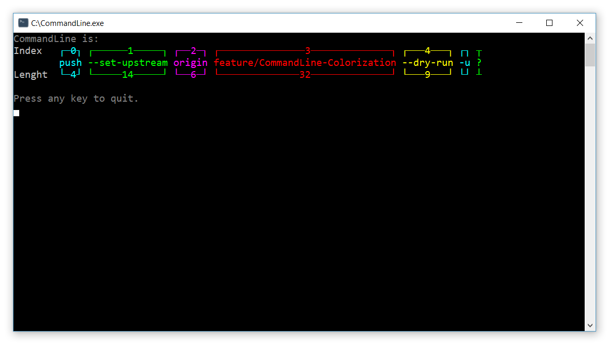
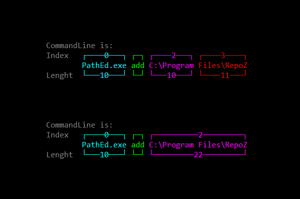

# ![windows][windows] CommandLine

This project is probably one of the smallest ones I've ever done and likely even simpler than "Hello World!".
Anyway, I needed this way too often and I had to code it again and again because I never kept it.

This tool simply shows the command line arguments passed to it. That's it, for real.

Despite its simplicity, it (or the versions I coded and threw away) was quite useful in the past. For example, when I wrote the Setup Wizard for [RepoZ](https://github.com/awaescher/RepoZ) and wanted to start [PathEd](https://github.com/awaescher/PathEd) with some arguments.

As I was testing the setup, I had issues with adding RepoZ to the Windows PATH variables. By replacing PathEd.exe in the Setup with CommandLine.exe (named PathEd.exe), I found out that I was not escaping the path string correctly in the NSIS script which then skipped the quotes in the directory argument. Windows then split directories with spaces as multiple arguments (of course 😐).

So this tool helped me again to spot the error quickly by showing the first part of the following image. I knew I wanted the second one, of course.

[windows]: https://raw.githubusercontent.com/MarcBruins/awesome-xamarin/master/images/windows.png
